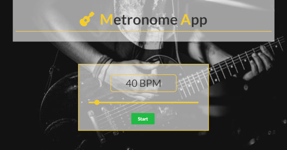
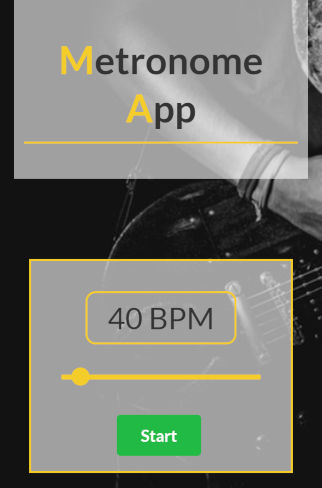

This project was bootstrapped with [Create React App](https://github.com/facebook/create-react-app).

# METRONOME APP
> Hi everyone! This is my version of simple METRONOME APP. 

## Live
https://mateuszlubianka1993.github.io/metronome-app/

## Technologies:
* React
* Java Script
* HTML5
* CSS 3
* Semantic UI

## General info
I made this app to learn basic skills in React. 
This is simple Metronome App. You can use it to develop your music skills. 

## Screenshots

## Contact
Created by [lubiankamateusz@gmail.com] - feel free to contact me!